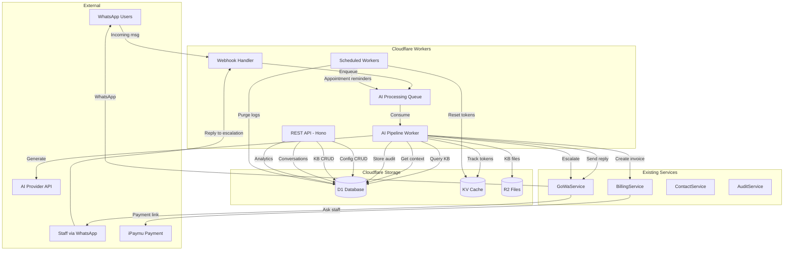
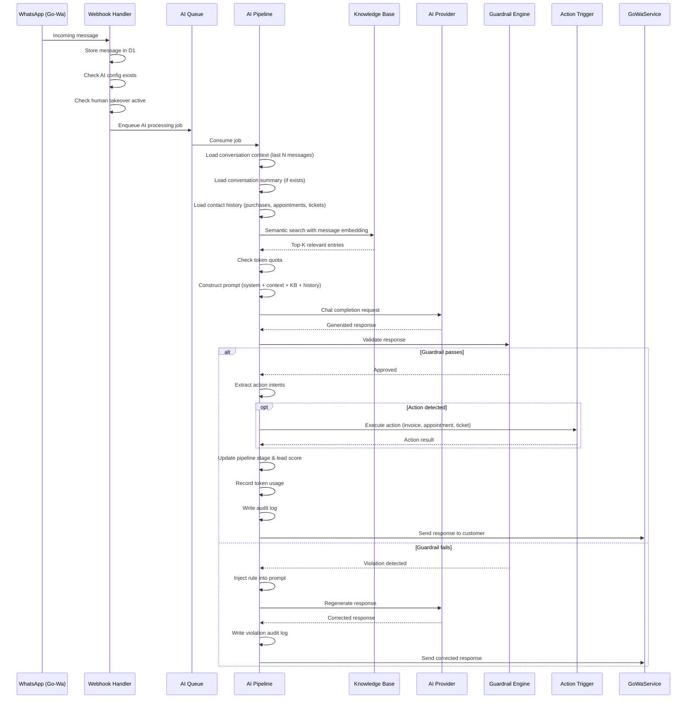

# Technical Design: AI Sales Agent

## Overview

The AI Sales Agent extends the existing Omnichannel SaaS CRM platform with an autonomous conversational AI module that operates within each tenant's WhatsApp channel. It receives incoming messages via the existing Go-Wa webhook, processes them through a multi-stage pipeline (context assembly → knowledge retrieval → prompt construction → AI generation → guardrail validation → response delivery), and can autonomously trigger business actions (invoicing, appointments, tickets, escalation).

The system is designed as a set of loosely coupled services that plug into the existing Hono + Cloudflare Workers architecture, reusing the established patterns for tenant isolation, caching (KV), storage (R2/D1), and messaging (GoWaService).

### Key Design Decisions

1. **Embedding Storage in D1**: Store float32 embedding vectors as base64-encoded TEXT in D1 rather than a dedicated vector database. Cosine similarity computed in-Worker for small-to-medium knowledge bases (< 10K entries per tenant). For larger tenants, Cloudflare Vectorize can be added later.
2. **OpenAI-Compatible API Abstraction**: The AI provider interface uses the OpenAI chat completions format, allowing tenants to use any compatible provider (OpenAI, Anthropic via proxy, local models, etc.).
3. **Queue-Based Async Processing**: Long-running AI processing uses Cloudflare Queues to avoid blocking the webhook response. The webhook acknowledges receipt immediately, and the AI pipeline runs asynchronously.
4. **Guardrails as Middleware**: The guardrail engine runs as a validation pass on AI output before delivery, using rule-based checks (no additional AI calls for basic rules) and optional AI-based hallucination detection.
5. **Escalation via Message Tagging**: Staff escalation messages are tagged with a correlation ID in the message metadata, allowing the webhook handler to route staff replies back to the correct pending conversation.

---

## Architecture

### High-Level System Diagram



### Message Processing Pipeline



---

## Components and Interfaces

### New Services

| Service | File | Responsibility |
|---------|------|---------------|
| `AIConfigService` | `src/services/ai/config.ts` | Per-tenant AI agent configuration CRUD with KV caching |
| `KnowledgeBaseService` | `src/services/ai/knowledgeBase.ts` | KB entry CRUD, embedding generation, semantic search |
| `AIPipelineService` | `src/services/ai/pipeline.ts` | Core message processing orchestrator |
| `PromptBuilder` | `src/services/ai/promptBuilder.ts` | Constructs AI prompts from context, KB, history |
| `GuardrailEngine` | `src/services/ai/guardrails.ts` | Response validation against business rules |
| `ActionTriggerService` | `src/services/ai/actions.ts` | Action registry and execution |
| `AppointmentService` | `src/services/ai/appointments.ts` | Availability management and booking |
| `SupportTicketService` | `src/services/ai/tickets.ts` | Ticket CRUD with auto-categorization |
| `LeadScorerService` | `src/services/ai/leadScorer.ts` | Lead qualification scoring |
| `EscalationService` | `src/services/ai/escalation.ts` | Staff escalation and dynamic knowledge |
| `TokenTrackerService` | `src/services/ai/tokenTracker.ts` | Token usage recording and quota enforcement |
| `ConversationService` | `src/services/ai/conversations.ts` | Unified inbox, summaries, human takeover |
| `AIAuditService` | `src/services/ai/audit.ts` | AI interaction logging and analytics |

### New Routes

| Route Group | File | Endpoints |
|-------------|------|-----------|
| AI Config | `src/routes/ai/config.ts` | `GET/PUT /api/ai/config` |
| Knowledge Base | `src/routes/ai/knowledgeBase.ts` | `CRUD /api/ai/knowledge-base`, `POST /api/ai/knowledge-base/bulk` |
| Products | `src/routes/ai/products.ts` | `CRUD /api/ai/products` |
| Appointments | `src/routes/ai/appointments.ts` | `CRUD /api/ai/appointments`, `GET /api/ai/appointments/available` |
| Tickets | `src/routes/ai/tickets.ts` | `CRUD /api/ai/tickets` |
| Conversations | `src/routes/ai/conversations.ts` | `GET /api/ai/conversations`, `POST assign/release/notes` |
| Analytics | `src/routes/ai/analytics.ts` | `GET /api/ai/analytics`, `GET /api/ai/audit-logs` |
| Token Usage | `src/routes/ai/tokens.ts` | `GET /api/ai/tokens/usage` |
| Business Rules | `src/routes/ai/rules.ts` | `CRUD /api/ai/rules` |
| Escalation Config | `src/routes/ai/escalation.ts` | `CRUD /api/ai/escalation/staff` |

### New Queue Consumer

| Consumer | File | Purpose |
|----------|------|---------|
| `aiProcessingConsumer` | `src/workers/aiConsumer.ts` | Processes AI pipeline jobs from queue |
| `appointmentReminderConsumer` | `src/workers/reminderConsumer.ts` | Sends appointment reminders |

### Modified Existing Components

| Component | Modification |
|-----------|-------------|
| `src/routes/webhooks.ts` | Add AI processing trigger after incoming message storage |
| `src/index.ts` | Register new route modules and queue consumers |
| `src/types/bindings.ts` | Add `AI_QUEUE` binding and `AI_PROVIDER_*` env vars |
| `wrangler.toml` | Add AI queue, cron triggers |

---

## Data Models

### New D1 Tables

```sql
-- AI Agent Configuration per tenant
CREATE TABLE ai_agent_config (
    id TEXT PRIMARY KEY,
    tenant_id TEXT NOT NULL UNIQUE,
    provider_url TEXT NOT NULL,
    model_name TEXT NOT NULL,
    api_key_encrypted TEXT NOT NULL,
    system_prompt TEXT NOT NULL,
    temperature REAL NOT NULL DEFAULT 0.7,
    max_tokens INTEGER NOT NULL DEFAULT 1024,
    context_window INTEGER NOT NULL DEFAULT 20,
    language TEXT NOT NULL DEFAULT 'id',
    tone TEXT NOT NULL DEFAULT 'friendly_professional',
    confidence_threshold REAL NOT NULL DEFAULT 0.7,
    active INTEGER NOT NULL DEFAULT 1,
    created_at TEXT NOT NULL DEFAULT (datetime('now')),
    updated_at TEXT NOT NULL DEFAULT (datetime('now')),
    FOREIGN KEY (tenant_id) REFERENCES tenants(id)
);

-- Knowledge Base entries
CREATE TABLE knowledge_base (
    id TEXT PRIMARY KEY,
    tenant_id TEXT NOT NULL,
    title TEXT NOT NULL,
    content TEXT NOT NULL,
    category TEXT NOT NULL,
    tags TEXT, -- JSON array
    embedding TEXT, -- base64-encoded float32 vector
    file_r2_key TEXT,
    entry_type TEXT NOT NULL DEFAULT 'faq' CHECK(entry_type IN ('faq','product','policy','learned')),
    source TEXT DEFAULT 'manual' CHECK(source IN ('manual','escalation','bulk_import')),
    created_at TEXT NOT NULL DEFAULT (datetime('now')),
    updated_at TEXT NOT NULL DEFAULT (datetime('now')),
    FOREIGN KEY (tenant_id) REFERENCES tenants(id)
);

CREATE INDEX idx_kb_tenant ON knowledge_base(tenant_id);
CREATE INDEX idx_kb_category ON knowledge_base(tenant_id, category);
CREATE INDEX idx_kb_type ON knowledge_base(tenant_id, entry_type);

-- Product Catalog (specialized KB entries)
CREATE TABLE product_catalog (
    id TEXT PRIMARY KEY,
    tenant_id TEXT NOT NULL,
    kb_entry_id TEXT,
    name TEXT NOT NULL,
    description TEXT NOT NULL,
    price INTEGER NOT NULL, -- in smallest currency unit (e.g., IDR)
    currency TEXT NOT NULL DEFAULT 'IDR',
    availability TEXT NOT NULL DEFAULT 'available' CHECK(availability IN ('available','out_of_stock','pre_order','discontinued')),
    image_r2_keys TEXT, -- JSON array of R2 keys
    custom_attributes TEXT, -- JSON object
    min_price INTEGER, -- minimum allowed after discount
    created_at TEXT NOT NULL DEFAULT (datetime('now')),
    updated_at TEXT NOT NULL DEFAULT (datetime('now')),
    FOREIGN KEY (tenant_id) REFERENCES tenants(id),
    FOREIGN KEY (kb_entry_id) REFERENCES knowledge_base(id)
);

CREATE INDEX idx_products_tenant ON product_catalog(tenant_id);
CREATE INDEX idx_products_availability ON product_catalog(tenant_id, availability);

-- Business Rules for guardrails
CREATE TABLE business_rules (
    id TEXT PRIMARY KEY,
    tenant_id TEXT NOT NULL,
    rule_type TEXT NOT NULL CHECK(rule_type IN ('max_discount','restricted_topic','required_disclaimer','prohibited_phrase','custom')),
    rule_name TEXT NOT NULL,
    rule_config TEXT NOT NULL, -- JSON: varies by type
    active INTEGER NOT NULL DEFAULT 1,
    priority INTEGER NOT NULL DEFAULT 0,
    created_at TEXT NOT NULL DEFAULT (datetime('now')),
    updated_at TEXT NOT NULL DEFAULT (datetime('now')),
    FOREIGN KEY (tenant_id) REFERENCES tenants(id)
);

CREATE INDEX idx_rules_tenant ON business_rules(tenant_id, active);

-- Sales Pipeline tracking
CREATE TABLE sales_pipeline (
    id TEXT PRIMARY KEY,
    tenant_id TEXT NOT NULL,
    contact_id TEXT NOT NULL,
    stage TEXT NOT NULL DEFAULT 'inquiry' CHECK(stage IN ('inquiry','explanation','negotiation','closing','invoiced','paid')),
    product_id TEXT,
    notes TEXT,
    created_at TEXT NOT NULL DEFAULT (datetime('now')),
    updated_at TEXT NOT NULL DEFAULT (datetime('now')),
    FOREIGN KEY (tenant_id) REFERENCES tenants(id),
    FOREIGN KEY (contact_id) REFERENCES contacts(id),
    FOREIGN KEY (product_id) REFERENCES product_catalog(id)
);

CREATE INDEX idx_pipeline_tenant ON sales_pipeline(tenant_id, stage);
CREATE INDEX idx_pipeline_contact ON sales_pipeline(tenant_id, contact_id);

-- Appointments
CREATE TABLE appointments (
    id TEXT PRIMARY KEY,
    tenant_id TEXT NOT NULL,
    contact_id TEXT NOT NULL,
    date TEXT NOT NULL,
    time_start TEXT NOT NULL,
    time_end TEXT NOT NULL,
    duration_minutes INTEGER NOT NULL,
    status TEXT NOT NULL DEFAULT 'confirmed' CHECK(status IN ('confirmed','cancelled','completed','no_show')),
    notes TEXT,
    reminder_24h_sent INTEGER NOT NULL DEFAULT 0,
    reminder_1h_sent INTEGER NOT NULL DEFAULT 0,
    created_at TEXT NOT NULL DEFAULT (datetime('now')),
    updated_at TEXT NOT NULL DEFAULT (datetime('now')),
    FOREIGN KEY (tenant_id) REFERENCES tenants(id),
    FOREIGN KEY (contact_id) REFERENCES contacts(id)
);

CREATE INDEX idx_appointments_tenant ON appointments(tenant_id, date);
CREATE INDEX idx_appointments_contact ON appointments(tenant_id, contact_id);

-- Appointment availability configuration
CREATE TABLE appointment_availability (
    id TEXT PRIMARY KEY,
    tenant_id TEXT NOT NULL,
    day_of_week INTEGER NOT NULL CHECK(day_of_week BETWEEN 0 AND 6),
    time_start TEXT NOT NULL,
    time_end TEXT NOT NULL,
    slot_duration_minutes INTEGER NOT NULL DEFAULT 60,
    buffer_minutes INTEGER NOT NULL DEFAULT 15,
    active INTEGER NOT NULL DEFAULT 1,
    FOREIGN KEY (tenant_id) REFERENCES tenants(id)
);

CREATE INDEX idx_availability_tenant ON appointment_availability(tenant_id, day_of_week);

-- Support Tickets
CREATE TABLE support_tickets (
    id TEXT PRIMARY KEY,
    tenant_id TEXT NOT NULL,
    contact_id TEXT NOT NULL,
    type TEXT NOT NULL CHECK(type IN ('billing','technical','product','general')),
    description TEXT NOT NULL,
    priority TEXT NOT NULL DEFAULT 'medium' CHECK(priority IN ('low','medium','high','critical')),
    status TEXT NOT NULL DEFAULT 'open' CHECK(status IN ('open','in_progress','escalated','resolved','closed')),
    assigned_to TEXT,
    resolution TEXT,
    conversation_turns INTEGER NOT NULL DEFAULT 0,
    created_at TEXT NOT NULL DEFAULT (datetime('now')),
    updated_at TEXT NOT NULL DEFAULT (datetime('now')),
    FOREIGN KEY (tenant_id) REFERENCES tenants(id),
    FOREIGN KEY (contact_id) REFERENCES contacts(id)
);

CREATE INDEX idx_tickets_tenant ON support_tickets(tenant_id, status);
CREATE INDEX idx_tickets_priority ON support_tickets(tenant_id, priority);
CREATE INDEX idx_tickets_contact ON support_tickets(tenant_id, contact_id);

-- Lead Scoring
CREATE TABLE lead_scores (
    id TEXT PRIMARY KEY,
    tenant_id TEXT NOT NULL,
    contact_id TEXT NOT NULL,
    score TEXT NOT NULL DEFAULT 'cold' CHECK(score IN ('hot','warm','cold')),
    numeric_score INTEGER NOT NULL DEFAULT 0,
    scoring_factors TEXT, -- JSON array of factor contributions
    last_scored_at TEXT NOT NULL DEFAULT (datetime('now')),
    FOREIGN KEY (tenant_id) REFERENCES tenants(id),
    FOREIGN KEY (contact_id) REFERENCES contacts(id)
);

CREATE INDEX idx_lead_scores_tenant ON lead_scores(tenant_id, score);
CREATE INDEX idx_lead_scores_contact ON lead_scores(tenant_id, contact_id);

-- Lead Scoring Configuration
CREATE TABLE lead_scoring_config (
    id TEXT PRIMARY KEY,
    tenant_id TEXT NOT NULL,
    factor_type TEXT NOT NULL CHECK(factor_type IN ('keyword','pattern','timing','engagement')),
    factor_config TEXT NOT NULL, -- JSON: keywords, regex patterns, etc.
    weight INTEGER NOT NULL DEFAULT 1,
    active INTEGER NOT NULL DEFAULT 1,
    FOREIGN KEY (tenant_id) REFERENCES tenants(id)
);

CREATE INDEX idx_scoring_config_tenant ON lead_scoring_config(tenant_id);

-- Escalation staff contacts
CREATE TABLE escalation_staff (
    id TEXT PRIMARY KEY,
    tenant_id TEXT NOT NULL,
    name TEXT NOT NULL,
    phone_number TEXT NOT NULL,
    priority_order INTEGER NOT NULL DEFAULT 0,
    specialties TEXT, -- JSON array of categories
    active INTEGER NOT NULL DEFAULT 1,
    FOREIGN KEY (tenant_id) REFERENCES tenants(id)
);

CREATE INDEX idx_escalation_staff_tenant ON escalation_staff(tenant_id, priority_order);

-- Pending escalations
CREATE TABLE pending_escalations (
    id TEXT PRIMARY KEY,
    tenant_id TEXT NOT NULL,
    contact_id TEXT NOT NULL,
    staff_id TEXT NOT NULL,
    correlation_id TEXT NOT NULL UNIQUE,
    question TEXT NOT NULL,
    context_summary TEXT,
    status TEXT NOT NULL DEFAULT 'pending' CHECK(status IN ('pending','answered','timeout')),
    staff_response TEXT,
    created_at TEXT NOT NULL DEFAULT (datetime('now')),
    responded_at TEXT,
    timeout_at TEXT NOT NULL,
    FOREIGN KEY (tenant_id) REFERENCES tenants(id),
    FOREIGN KEY (contact_id) REFERENCES contacts(id),
    FOREIGN KEY (staff_id) REFERENCES escalation_staff(id)
);

CREATE INDEX idx_escalations_correlation ON pending_escalations(correlation_id);
CREATE INDEX idx_escalations_tenant ON pending_escalations(tenant_id, status);
CREATE INDEX idx_escalations_timeout ON pending_escalations(status, timeout_at);

-- Conversation summaries
CREATE TABLE conversation_summaries (
    id TEXT PRIMARY KEY,
    tenant_id TEXT NOT NULL,
    contact_id TEXT NOT NULL,
    summary TEXT NOT NULL,
    key_facts TEXT, -- JSON array
    message_range_start TEXT NOT NULL,
    message_range_end TEXT NOT NULL,
    created_at TEXT NOT NULL DEFAULT (datetime('now')),
    FOREIGN KEY (tenant_id) REFERENCES tenants(id),
    FOREIGN KEY (contact_id) REFERENCES contacts(id)
);

CREATE INDEX idx_summaries_contact ON conversation_summaries(tenant_id, contact_id);

-- Human takeover state
CREATE TABLE conversation_assignments (
    id TEXT PRIMARY KEY,
    tenant_id TEXT NOT NULL,
    contact_id TEXT NOT NULL,
    assigned_user_id TEXT NOT NULL,
    assigned_at TEXT NOT NULL DEFAULT (datetime('now')),
    released_at TEXT,
    active INTEGER NOT NULL DEFAULT 1,
    FOREIGN KEY (tenant_id) REFERENCES tenants(id),
    FOREIGN KEY (contact_id) REFERENCES contacts(id)
);

CREATE INDEX idx_assignments_active ON conversation_assignments(tenant_id, contact_id, active);

-- Conversation notes (internal)
CREATE TABLE conversation_notes (
    id TEXT PRIMARY KEY,
    tenant_id TEXT NOT NULL,
    contact_id TEXT NOT NULL,
    user_id TEXT NOT NULL,
    content TEXT NOT NULL,
    tags TEXT, -- JSON array
    created_at TEXT NOT NULL DEFAULT (datetime('now')),
    FOREIGN KEY (tenant_id) REFERENCES tenants(id),
    FOREIGN KEY (contact_id) REFERENCES contacts(id)
);

CREATE INDEX idx_notes_contact ON conversation_notes(tenant_id, contact_id);

-- Token usage tracking
CREATE TABLE token_usage (
    id TEXT PRIMARY KEY,
    tenant_id TEXT NOT NULL,
    model TEXT NOT NULL,
    prompt_tokens INTEGER NOT NULL,
    completion_tokens INTEGER NOT NULL,
    total_tokens INTEGER NOT NULL,
    purpose TEXT NOT NULL DEFAULT 'conversation' CHECK(purpose IN ('conversation','summary','embedding','guardrail')),
    created_at TEXT NOT NULL DEFAULT (datetime('now'))
);

CREATE INDEX idx_token_usage_tenant ON token_usage(tenant_id, created_at);
CREATE INDEX idx_token_usage_monthly ON token_usage(tenant_id, created_at);

-- Token quota configuration
CREATE TABLE token_quotas (
    id TEXT PRIMARY KEY,
    tenant_id TEXT NOT NULL UNIQUE,
    monthly_limit INTEGER NOT NULL DEFAULT 1000000,
    warning_threshold REAL NOT NULL DEFAULT 0.8,
    created_at TEXT NOT NULL DEFAULT (datetime('now')),
    updated_at TEXT NOT NULL DEFAULT (datetime('now')),
    FOREIGN KEY (tenant_id) REFERENCES tenants(id)
);

-- Action trigger registry
CREATE TABLE action_triggers (
    id TEXT PRIMARY KEY,
    tenant_id TEXT NOT NULL,
    action_type TEXT NOT NULL CHECK(action_type IN ('send_invoice','create_appointment','create_ticket','update_pipeline','notify_staff','custom_webhook')),
    action_name TEXT NOT NULL,
    config TEXT NOT NULL, -- JSON: webhook URL, parameter schema, etc.
    parameter_schema TEXT NOT NULL, -- JSON Schema for validation
    active INTEGER NOT NULL DEFAULT 1,
    created_at TEXT NOT NULL DEFAULT (datetime('now')),
    updated_at TEXT NOT NULL DEFAULT (datetime('now')),
    FOREIGN KEY (tenant_id) REFERENCES tenants(id)
);

CREATE INDEX idx_actions_tenant ON action_triggers(tenant_id, action_type);

-- AI interaction audit log
CREATE TABLE ai_audit_log (
    id TEXT PRIMARY KEY,
    tenant_id TEXT NOT NULL,
    contact_id TEXT NOT NULL,
    input_message TEXT NOT NULL,
    kb_entries_used TEXT, -- JSON array of KB entry IDs
    constructed_prompt TEXT NOT NULL,
    raw_ai_response TEXT NOT NULL,
    guardrail_result TEXT NOT NULL CHECK(guardrail_result IN ('passed','violated','regenerated')),
    violated_rules TEXT, -- JSON array of rule IDs
    final_sent_message TEXT NOT NULL,
    prompt_tokens INTEGER NOT NULL,
    completion_tokens INTEGER NOT NULL,
    response_time_ms INTEGER NOT NULL,
    actions_triggered TEXT, -- JSON array
    created_at TEXT NOT NULL DEFAULT (datetime('now'))
);

CREATE INDEX idx_ai_audit_tenant ON ai_audit_log(tenant_id, created_at);
CREATE INDEX idx_ai_audit_guardrail ON ai_audit_log(tenant_id, guardrail_result);

-- Sales transactions (AI-initiated invoices)
CREATE TABLE ai_sales_transactions (
    id TEXT PRIMARY KEY,
    tenant_id TEXT NOT NULL,
    contact_id TEXT NOT NULL,
    product_id TEXT,
    pipeline_id TEXT,
    amount INTEGER NOT NULL,
    discount_percent REAL NOT NULL DEFAULT 0,
    final_amount INTEGER NOT NULL,
    payment_link_url TEXT,
    payment_status TEXT NOT NULL DEFAULT 'pending' CHECK(payment_status IN ('pending','paid','expired','cancelled')),
    ipaymu_transaction_id TEXT,
    created_at TEXT NOT NULL DEFAULT (datetime('now')),
    updated_at TEXT NOT NULL DEFAULT (datetime('now')),
    FOREIGN KEY (tenant_id) REFERENCES tenants(id),
    FOREIGN KEY (contact_id) REFERENCES contacts(id),
    FOREIGN KEY (product_id) REFERENCES product_catalog(id),
    FOREIGN KEY (pipeline_id) REFERENCES sales_pipeline(id)
);

CREATE INDEX idx_ai_sales_tenant ON ai_sales_transactions(tenant_id, payment_status);
CREATE INDEX idx_ai_sales_contact ON ai_sales_transactions(tenant_id, contact_id);
```

### KV Cache Key Patterns

| Key Pattern | Value | TTL | Purpose |
|-------------|-------|-----|---------|
| `ai_config:{tenant_id}` | JSON AI config | 300s | Fast config lookup |
| `token_usage:{tenant_id}:{YYYY-MM}` | Token count (integer) | 3600s | Monthly usage counter |
| `human_takeover:{tenant_id}:{contact_id}` | `"1"` or absent | 0 (no expiry) | Human takeover flag |
| `escalation_pending:{correlation_id}` | JSON escalation state | 1800s | Pending escalation tracking |
| `lead_score:{tenant_id}:{contact_id}` | Score string | 300s | Fast score lookup |
| `pipeline:{tenant_id}:{contact_id}` | Stage string | 120s | Fast pipeline lookup |

### TypeScript Interfaces (Key New Types)

```typescript
// src/types/ai.ts

export interface AIAgentConfig {
  id: string;
  tenant_id: string;
  provider_url: string;
  model_name: string;
  api_key_encrypted: string;
  system_prompt: string;
  temperature: number;
  max_tokens: number;
  context_window: number;
  language: string;
  tone: string;
  confidence_threshold: number;
  active: number;
  created_at: string;
  updated_at: string;
}

export interface KnowledgeBaseEntry {
  id: string;
  tenant_id: string;
  title: string;
  content: string;
  category: string;
  tags: string | null; // JSON array
  embedding: string | null; // base64 float32 vector
  file_r2_key: string | null;
  entry_type: 'faq' | 'product' | 'policy' | 'learned';
  source: 'manual' | 'escalation' | 'bulk_import';
  created_at: string;
  updated_at: string;
}

export interface ProductEntry {
  id: string;
  tenant_id: string;
  kb_entry_id: string | null;
  name: string;
  description: string;
  price: number;
  currency: string;
  availability: 'available' | 'out_of_stock' | 'pre_order' | 'discontinued';
  image_r2_keys: string | null; // JSON array
  custom_attributes: string | null; // JSON object
  min_price: number | null;
  created_at: string;
  updated_at: string;
}

export interface BusinessRule {
  id: string;
  tenant_id: string;
  rule_type: 'max_discount' | 'restricted_topic' | 'required_disclaimer' | 'prohibited_phrase' | 'custom';
  rule_name: string;
  rule_config: string; // JSON
  active: number;
  priority: number;
  created_at: string;
  updated_at: string;
}

export type PipelineStage = 'inquiry' | 'explanation' | 'negotiation' | 'closing' | 'invoiced' | 'paid';

export interface SalesPipeline {
  id: string;
  tenant_id: string;
  contact_id: string;
  stage: PipelineStage;
  product_id: string | null;
  notes: string | null;
  created_at: string;
  updated_at: string;
}

export interface Appointment {
  id: string;
  tenant_id: string;
  contact_id: string;
  date: string;
  time_start: string;
  time_end: string;
  duration_minutes: number;
  status: 'confirmed' | 'cancelled' | 'completed' | 'no_show';
  notes: string | null;
  reminder_24h_sent: number;
  reminder_1h_sent: number;
  created_at: string;
  updated_at: string;
}

export interface AppointmentAvailability {
  id: string;
  tenant_id: string;
  day_of_week: number; // 0=Sunday, 6=Saturday
  time_start: string; // HH:MM
  time_end: string;   // HH:MM
  slot_duration_minutes: number;
  buffer_minutes: number;
  active: number;
}

export interface SupportTicket {
  id: string;
  tenant_id: string;
  contact_id: string;
  type: 'billing' | 'technical' | 'product' | 'general';
  description: string;
  priority: 'low' | 'medium' | 'high' | 'critical';
  status: 'open' | 'in_progress' | 'escalated' | 'resolved' | 'closed';
  assigned_to: string | null;
  resolution: string | null;
  conversation_turns: number;
  created_at: string;
  updated_at: string;
}

export type LeadScore = 'hot' | 'warm' | 'cold';

export interface LeadScoreRecord {
  id: string;
  tenant_id: string;
  contact_id: string;
  score: LeadScore;
  numeric_score: number;
  scoring_factors: string | null; // JSON
  last_scored_at: string;
}

export interface EscalationStaff {
  id: string;
  tenant_id: string;
  name: string;
  phone_number: string;
  priority_order: number;
  specialties: string | null; // JSON array
  active: number;
}

export interface PendingEscalation {
  id: string;
  tenant_id: string;
  contact_id: string;
  staff_id: string;
  correlation_id: string;
  question: string;
  context_summary: string | null;
  status: 'pending' | 'answered' | 'timeout';
  staff_response: string | null;
  created_at: string;
  responded_at: string | null;
  timeout_at: string;
}

export interface ConversationSummary {
  id: string;
  tenant_id: string;
  contact_id: string;
  summary: string;
  key_facts: string | null; // JSON array
  message_range_start: string;
  message_range_end: string;
  created_at: string;
}

export interface TokenUsageRecord {
  id: string;
  tenant_id: string;
  model: string;
  prompt_tokens: number;
  completion_tokens: number;
  total_tokens: number;
  purpose: 'conversation' | 'summary' | 'embedding' | 'guardrail';
  created_at: string;
}

export interface ActionTrigger {
  id: string;
  tenant_id: string;
  action_type: 'send_invoice' | 'create_appointment' | 'create_ticket' | 'update_pipeline' | 'notify_staff' | 'custom_webhook';
  action_name: string;
  config: string; // JSON
  parameter_schema: string; // JSON Schema
  active: number;
  created_at: string;
  updated_at: string;
}

export interface AIAuditLog {
  id: string;
  tenant_id: string;
  contact_id: string;
  input_message: string;
  kb_entries_used: string | null;
  constructed_prompt: string;
  raw_ai_response: string;
  guardrail_result: 'passed' | 'violated' | 'regenerated';
  violated_rules: string | null;
  final_sent_message: string;
  prompt_tokens: number;
  completion_tokens: number;
  response_time_ms: number;
  actions_triggered: string | null;
  created_at: string;
}

// AI Provider interface (OpenAI-compatible)
export interface ChatCompletionMessage {
  role: 'system' | 'user' | 'assistant';
  content: string;
}

export interface ChatCompletionRequest {
  model: string;
  messages: ChatCompletionMessage[];
  temperature?: number;
  max_tokens?: number;
}

export interface ChatCompletionResponse {
  choices: Array<{
    message: { role: string; content: string };
    finish_reason: string;
  }>;
  usage: {
    prompt_tokens: number;
    completion_tokens: number;
    total_tokens: number;
  };
}

// Queue job payloads
export interface AIProcessingJob {
  tenant_id: string;
  contact_id: string;
  message_id: string;
  sender_phone: string;
  message_content: string;
  message_type: string;
}

export interface ReminderJob {
  tenant_id: string;
  contact_id: string;
  appointment_id: string;
  reminder_type: '24h' | '1h';
}

// Guardrail types
export interface GuardrailResult {
  passed: boolean;
  violations: GuardrailViolation[];
}

export interface GuardrailViolation {
  rule_id: string;
  rule_type: string;
  rule_name: string;
  violation_detail: string;
}

// Action execution types
export interface ActionExecutionResult {
  success: boolean;
  action_type: string;
  result_data: Record<string, unknown>;
  error?: string;
}

// Prompt assembly context
export interface ConversationContext {
  messages: ChatCompletionMessage[];
  summary: string | null;
  contact_history: {
    purchases: Array<{ product: string; date: string; amount: number }>;
    appointments: Array<{ date: string; status: string }>;
    tickets: Array<{ type: string; status: string; description: string }>;
  };
  kb_entries: Array<{ title: string; content: string; category: string }>;
  pipeline_stage: PipelineStage | null;
  lead_score: LeadScore | null;
}
```

---

## Correctness Properties

*A property is a characteristic or behavior that should hold true across all valid executions of a system — essentially, a formal statement about what the system should do. Properties serve as the bridge between human-readable specifications and machine-verifiable correctness guarantees.*

### Property 1: Configuration Round-Trip

*For any* valid AI agent configuration object (containing provider_url, model_name, system_prompt, temperature, max_tokens, language, and tone), storing it via `AIConfigService.upsert()` and then retrieving it via `AIConfigService.get()` SHALL produce an equivalent object (all fields match except timestamps).

**Validates: Requirements 1.1, 1.5**

### Property 2: Unconfigured Tenant Rejection

*For any* incoming message destined for a tenant that has no AI agent configuration record, the AI Pipeline SHALL reject the message with a `configuration-required` status and SHALL NOT invoke the AI provider API.

**Validates: Requirements 1.3**

### Property 3: Knowledge Base Entry Round-Trip

*For any* valid knowledge base entry (FAQ, product, policy) or product catalog entry with all required fields populated, creating it via the respective service and then retrieving it by ID SHALL produce an equivalent object with all fields preserved.

**Validates: Requirements 2.1, 2.3**

### Property 4: Semantic Search Ordering

*For any* set of knowledge base entries with embeddings and a query embedding vector, the results returned by `KnowledgeBaseService.semanticSearch()` SHALL be ordered by descending cosine similarity and limited to exactly K results (or fewer if the total is less than K).

**Validates: Requirements 2.4**

### Property 5: Bulk Import Validation

*For any* JSON array of knowledge base entries where some entries have valid required fields and others are missing required fields, the bulk import SHALL accept all valid entries and reject all invalid entries, returning error details for each rejected entry.

**Validates: Requirements 2.5**

### Property 6: Context Window Loading

*For any* contact with M messages in the database (M >= 0) and a configured context window of N, the AI Pipeline SHALL load exactly min(M, N) messages ordered by most recent first.

**Validates: Requirements 3.2, 10.1**

### Property 7: Prompt Assembly Completeness

*For any* returning contact with a conversation summary, purchase history, appointment history, and ticket history, the constructed prompt SHALL contain the system prompt, the conversation summary, relevant history references, KB search results, and recent messages — in that order.

**Validates: Requirements 3.1, 10.3, 10.4, 10.5**

### Property 8: Guardrail Rule Validation

*For any* AI response text and a set of active business rules (prohibited phrases, restricted topics, max discount, required disclaimers), the Guardrail Engine SHALL detect all violations where the response contains a prohibited phrase, mentions a restricted topic, offers a discount exceeding the maximum, or omits a required disclaimer.

**Validates: Requirements 3.5, 8.1**

### Property 9: Hallucination Detection

*For any* AI response containing factual claims about products (prices, availability, features) and a corresponding Knowledge Base, the Guardrail Engine SHALL flag claims that cannot be traced to any KB entry or the current conversation context.

**Validates: Requirements 8.2**

### Property 10: Pipeline State Validity

*For any* sales pipeline record, the stage value SHALL always be one of the valid stages, and stage transitions SHALL only follow the valid progression path: inquiry → explanation → negotiation → closing → invoiced → paid.

**Validates: Requirements 4.3**

### Property 11: Discount Constraint Enforcement

*For any* product with a configured minimum price (min_price) and a discount percentage offered during negotiation, the final offered price SHALL never be less than the product's min_price, and the discount SHALL never exceed the tenant's max_discount business rule.

**Validates: Requirements 4.4**

### Property 12: Appointment Slot Availability

*For any* set of existing confirmed appointments and a tenant's availability configuration, the available slots returned by `AppointmentService.getAvailableSlots()` SHALL NOT overlap with any existing confirmed appointment (including buffer time), and SHALL only fall within configured availability windows.

**Validates: Requirements 5.2, 5.6**

### Property 13: Appointment Booking Round-Trip

*For any* valid booking request with a date, time, and contact, creating the appointment and then retrieving it SHALL produce a record with matching contact_id, tenant_id, date, time_start, time_end, duration, and status='confirmed'.

**Validates: Requirements 5.1, 5.3**

### Property 14: Support Ticket Round-Trip and Filtering

*For any* set of support tickets with varying statuses and priorities, filtering by a specific status SHALL return only tickets with that status, and filtering by priority SHALL return only tickets with that priority. Combined filters SHALL return the intersection.

**Validates: Requirements 6.1, 6.5**

### Property 15: Escalation Turn Threshold

*For any* ongoing support conversation where the AI has been unable to resolve the issue, when the conversation turn count reaches exactly 2 unresolved turns, the system SHALL trigger escalation (status changes to 'escalated'). Below 2 turns, no escalation occurs.

**Validates: Requirements 6.4**

### Property 16: Lead Scoring Consistency

*For any* message content and a set of scoring criteria (keywords with weights, pattern matches), the numeric score computed by the Lead Scorer SHALL equal the sum of weights for all matching criteria, and the categorical score (hot/warm/cold) SHALL correspond to the correct threshold range.

**Validates: Requirements 7.1, 7.2, 7.3, 7.4**

### Property 17: Guardrail Violation Audit Completeness

*For any* guardrail violation event, the audit log entry SHALL contain the original AI response, the specific rule(s) violated, the violation type, and the corrected response that was ultimately sent.

**Validates: Requirements 8.5, 14.3**

### Property 18: Business Rule Configuration Round-Trip

*For any* valid business rule of any supported type (max_discount, restricted_topic, required_disclaimer, prohibited_phrase, custom), storing and retrieving the rule SHALL preserve the rule_type, rule_name, rule_config JSON, priority, and active status.

**Validates: Requirements 8.4**

### Property 19: Uncertainty Threshold Trigger

*For any* AI response with an associated confidence score, when the confidence is below the tenant's configured threshold, the system SHALL produce an uncertainty acknowledgment response. When confidence is at or above the threshold, the response SHALL be delivered normally.

**Validates: Requirements 8.6**

### Property 20: Escalation Message Formatting

*For any* escalation event with a customer question and conversation context, the escalation message sent to staff SHALL contain: (a) the customer's original question, (b) relevant conversation context, and (c) a specific description of what information is needed.

**Validates: Requirements 9.2**

### Property 21: Dynamic Knowledge Learning

*For any* staff response to an escalation, the system SHALL create a new Knowledge Base entry with the staff's answer as content, the original question as context in tags, entry_type='learned', and source='escalation'.

**Validates: Requirements 9.5**

### Property 22: Staff Command Parsing

*For any* message from a staff member matching the designated command format (e.g., `#KB: <title> | <content> | <category>`), the system SHALL create a Knowledge Base entry with the parsed title, content, and category.

**Validates: Requirements 9.8**

### Property 23: Token Usage Tracking Accuracy

*For any* sequence of AI API calls with known token counts, the running monthly total stored in KV SHALL equal the sum of all token usages for that tenant in the current month, and each individual usage record in D1 SHALL contain the correct prompt_tokens, completion_tokens, and total_tokens.

**Validates: Requirements 11.1, 11.2**

### Property 24: Quota Enforcement

*For any* tenant whose monthly token usage has reached or exceeded their configured monthly limit, the AI Pipeline SHALL reject new message processing and return a quota-exceeded status WITHOUT making any AI API calls.

**Validates: Requirements 11.3**

### Property 25: Usage API Correctness

*For any* tenant with a configured monthly limit and recorded usage, the usage API response SHALL report remaining_tokens = monthly_limit - current_usage, and current_usage SHALL equal the sum of all token_usage records for the current month.

**Validates: Requirements 11.4**

### Property 26: Quota Warning Threshold

*For any* tenant whose cumulative monthly token usage crosses exactly 80% (or their configured warning_threshold) of their monthly limit, the system SHALL trigger a warning notification. Below the threshold, no warning is sent.

**Validates: Requirements 11.5**

### Property 27: Action Trigger Schema Validation

*For any* action invocation parameters and a registered action's JSON Schema, the Action Trigger service SHALL accept parameters that conform to the schema and reject parameters that violate the schema with a descriptive error indicating which field failed validation.

**Validates: Requirements 12.3**

### Property 28: Human Takeover Round-Trip

*For any* conversation, when a staff member assigns themselves, the AI SHALL pause automatic responses for that contact (no AI processing occurs). When the staff member releases the conversation, the AI SHALL resume automatic responses for subsequent messages.

**Validates: Requirements 13.2, 13.3**

### Property 29: Internal Notes Isolation

*For any* internal notes or tags added to a conversation by staff, these notes SHALL be retrievable via the staff Conversation API but SHALL NOT appear in any AI-constructed prompt or customer-facing message.

**Validates: Requirements 13.4**

### Property 30: Conversation Thread Metadata Completeness

*For any* conversation thread returned by the Conversation API, the response SHALL include the current pipeline stage, lead score, and count of active tickets for that contact.

**Validates: Requirements 13.5**

### Property 31: Audit Log Completeness

*For any* AI interaction (message processed by the pipeline), the audit log entry SHALL contain: input_message, kb_entries_used, constructed_prompt, raw_ai_response, guardrail_result, final_sent_message, prompt_tokens, and completion_tokens.

**Validates: Requirements 14.1**

### Property 32: Analytics Aggregation Correctness

*For any* set of AI audit log entries within a date range, the analytics API SHALL return metrics where total_conversations equals the count of distinct contact sessions, messages_processed equals the total entries, and escalations equals entries where guardrail_result is not 'passed' or where an escalation was triggered.

**Validates: Requirements 14.4**

---

## Error Handling

### Error Categories and Responses

| Error Category | HTTP Code | Behavior |
|---------------|-----------|----------|
| AI config missing | 503 | Queue job skipped; webhook returns 200 (ack message stored) |
| AI provider unreachable | 503 | Retry with exponential backoff (max 3 retries via queue) |
| AI provider rate limit | 429 | Re-enqueue job with delay |
| Token quota exceeded | 429 | Reject processing; send customer notification |
| Guardrail violation | N/A | Regenerate response (max 2 attempts), then escalate to human |
| Invalid action parameters | 400 | Log error; inform customer action failed |
| Go-Wa send failure | N/A | Mark message as failed; log admin alert (existing pattern) |
| KV unavailable | N/A | Bypass cache; serve from D1 (existing pattern) |
| Escalation timeout | N/A | Create support ticket; notify customer |

### Retry Strategy

```typescript
interface RetryConfig {
  maxRetries: 3;
  baseDelayMs: 1000;
  maxDelayMs: 30000;
  backoffMultiplier: 2;
}
```

The AI processing queue uses Cloudflare Queues' built-in retry mechanism with exponential backoff. Failed jobs are retried up to 3 times before being moved to a dead letter queue for manual inspection.

### Circuit Breaker Pattern

The AI provider client implements a lightweight circuit breaker:
- **Closed**: Normal operation; requests flow through
- **Open**: After 5 consecutive failures within 60s, stop sending requests for 30s
- **Half-Open**: After cooldown, allow one probe request to test recovery

State is stored in KV at key `ai_circuit:{tenant_id}` with a 60s TTL.

---

## Testing Strategy

### Property-Based Tests (fast-check)

The project already includes `fast-check` as a dev dependency. Each correctness property maps to a property-based test with a minimum of 100 iterations.

**Test file structure:**
```
tests/property/ai/
  config.property.test.ts
  knowledgeBase.property.test.ts
  guardrails.property.test.ts
  pipeline.property.test.ts
  appointments.property.test.ts
  tickets.property.test.ts
  leadScorer.property.test.ts
  tokenTracker.property.test.ts
  actions.property.test.ts
  conversations.property.test.ts
  audit.property.test.ts
```

**Tag format for each test:**
```typescript
// Feature: ai-sales-agent, Property 8: Guardrail Rule Validation
it.prop([...generators], { numRuns: 100 }, (inputs) => { ... });
```

### Unit Tests (example-based)

Unit tests cover specific integration flows, edge cases, and error conditions:
- AI provider error handling (timeout, invalid response)
- Webhook routing for escalation responses
- Appointment conflict detection edge cases
- Pipeline stage transition validation
- Guardrail regeneration flow (violation → retry → success/escalate)

### Integration Tests

- End-to-end message flow: webhook → queue → AI → guardrail → response
- Escalation flow: AI → staff message → staff reply → customer response
- Sales flow: inquiry → negotiation → invoice → payment webhook
- Human takeover: assign → messages bypassed → release → AI resumes

### Test Configuration

```typescript
// vitest.config.ts addition
export default defineConfig({
  test: {
    include: [
      'tests/unit/**/*.test.ts',
      'tests/property/**/*.property.test.ts',
      'tests/integration/**/*.test.ts',
    ],
  },
});
```

Property tests use `fast-check` with:
- `numRuns: 100` minimum per property
- Custom arbitraries for domain types (phone numbers, message content, embedding vectors)
- Seeded runs for reproducibility
