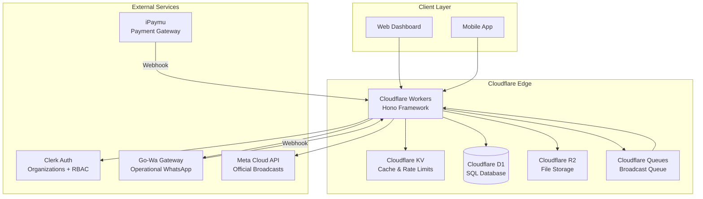
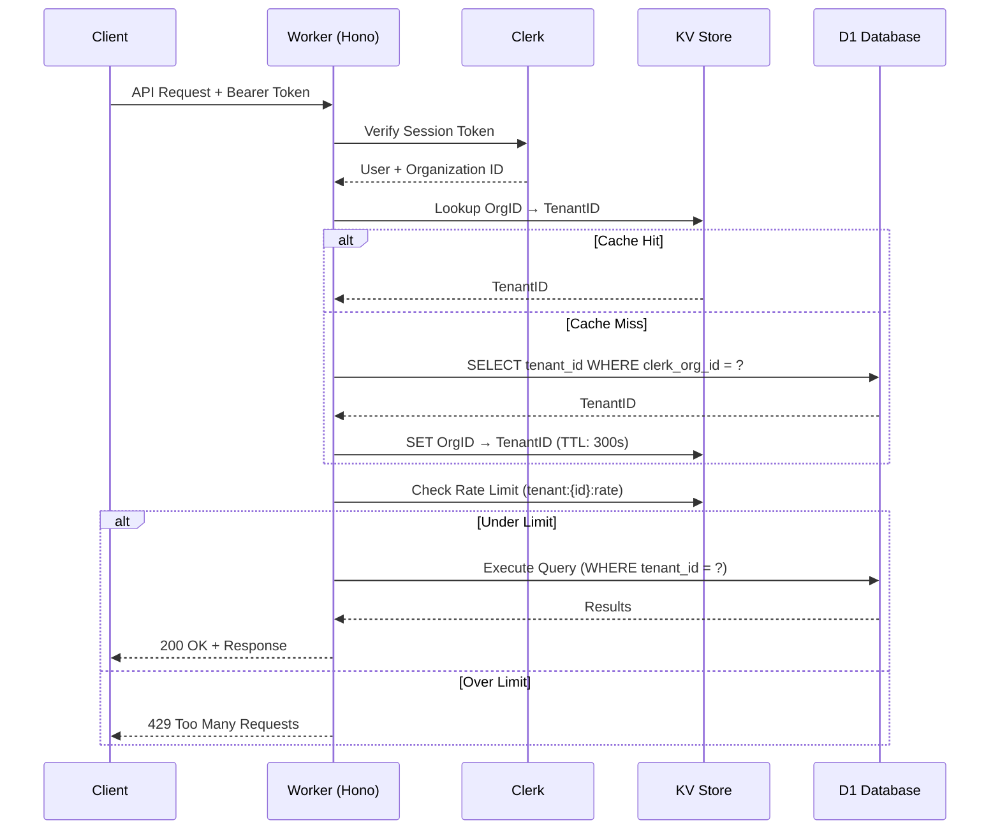
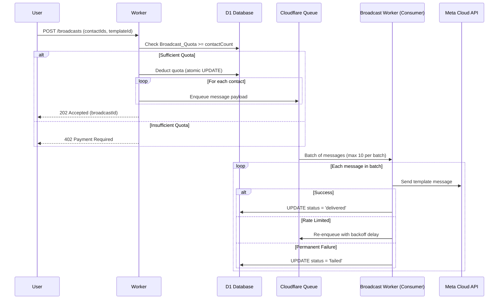
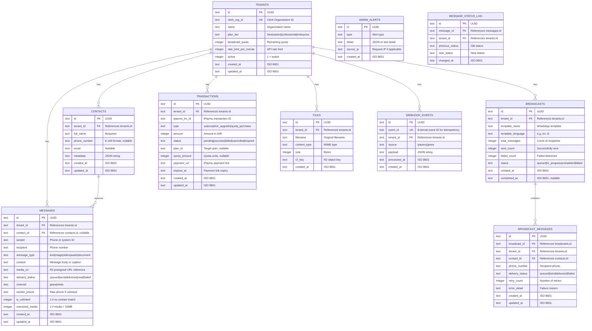

# Technical Design Document: Omnichannel SaaS CRM

## Overview

This document presents the technical design for an enterprise-grade Omnichannel SaaS CRM platform built entirely on the Cloudflare ecosystem. The platform provides multi-tenant customer relationship management with dual WhatsApp messaging channels (Go-Wa for operational messaging, Meta Cloud API for official broadcasts), SaaS subscription billing via iPaymu, and strict tenant data isolation.

**Key Architecture Decisions:**

1. **Edge-First Architecture**: All compute runs on Cloudflare Workers using the Hono framework, ensuring global low-latency access without managing servers.
2. **Dual WhatsApp Strategy**: Go-Wa (by Aldinokemal) handles real-time agent conversations without quota constraints; Meta Cloud API handles verified official broadcasts at scale.
3. **Shared-Database Multi-Tenancy with Row-Level Isolation**: A single D1 database with tenant_id columns on all tables, enforced at the application middleware layer.
4. **Event-Driven Broadcast Processing**: Cloudflare Queues decouple broadcast ingestion from delivery, enabling rate-controlled Meta Cloud API calls (80 msg/s per tenant).
5. **Clerk Organizations for Identity**: Clerk provides authentication, organization management, and RBAC without custom auth infrastructure.

**Technology Stack:**
- **Runtime**: Cloudflare Workers
- **Framework**: Hono (TypeScript)
- **Database**: Cloudflare D1 (SQLite-based SQL)
- **Cache**: Cloudflare KV
- **Object Storage**: Cloudflare R2
- **Message Queue**: Cloudflare Queues
- **Auth**: Clerk Organizations (multi-tenancy + RBAC)
- **WhatsApp Operational**: Go-Wa (aldinokemal/go-whatsapp-web-multidevice)
- **WhatsApp Broadcast**: Meta Cloud API (WhatsApp Business Platform)
- **Payment**: iPaymu (Indonesian payment gateway)

---

## Architecture

### High-Level System Architecture



### Request Flow Architecture



### Broadcast Message Flow



---

## Components and Interfaces

### 1. API Layer (Hono Router)

The main Worker application uses Hono's modular routing with middleware chains.

```typescript
// src/index.ts - Main application entry
import { Hono } from 'hono';
import { authMiddleware } from './middleware/auth';
import { tenantMiddleware } from './middleware/tenant';
import { rateLimitMiddleware } from './middleware/rateLimit';
import { contactsRouter } from './routes/contacts';
import { messagesRouter } from './routes/messages';
import { broadcastsRouter } from './routes/broadcasts';
import { billingRouter } from './routes/billing';
import { filesRouter } from './routes/files';
import { webhooksRouter } from './routes/webhooks';
import { auditRouter } from './routes/audit';

type Bindings = {
  DB: D1Database;
  KV: KVNamespace;
  R2: R2Bucket;
  BROADCAST_QUEUE: Queue;
  CLERK_SECRET_KEY: string;
  GOWA_BASE_URL: string;
  GOWA_API_KEY: string;
  META_ACCESS_TOKEN: string;
  META_PHONE_NUMBER_ID: string;
  IPAYMU_API_KEY: string;
  IPAYMU_VA: string;
  IPAYMU_SECRET: string;
};

type Variables = {
  tenantId: string;
  userId: string;
  orgId: string;
  permissions: string[];
};

const app = new Hono<{ Bindings: Bindings; Variables: Variables }>();

// Global middleware chain (order matters)
app.use('/api/*', authMiddleware);
app.use('/api/*', tenantMiddleware);
app.use('/api/*', rateLimitMiddleware);

// Route modules
app.route('/api/contacts', contactsRouter);
app.route('/api/messages', messagesRouter);
app.route('/api/broadcasts', broadcastsRouter);
app.route('/api/billing', billingRouter);
app.route('/api/files', filesRouter);
app.route('/api/audit', auditRouter);

// Webhook endpoints (no auth middleware - use signature validation)
app.route('/webhooks', webhooksRouter);

export default {
  fetch: app.fetch,
  queue: handleBroadcastQueue, // Cloudflare Queue consumer
};
```

### 2. Authentication Middleware

```typescript
// src/middleware/auth.ts
import { Context, MiddlewareHandler } from 'hono';
import { verifyToken } from '@clerk/backend';

export const authMiddleware: MiddlewareHandler = async (c, next) => {
  const authHeader = c.req.header('Authorization');
  if (!authHeader?.startsWith('Bearer ')) {
    return c.json({ error: 'Unauthorized' }, 401);
  }

  const token = authHeader.slice(7);
  
  try {
    const payload = await verifyToken(token, {
      secretKey: c.env.CLERK_SECRET_KEY,
    });

    const orgId = payload.org_id;
    if (!orgId) {
      return c.json({ error: 'Unauthorized', detail: 'No organization context' }, 401);
    }

    c.set('userId', payload.sub);
    c.set('orgId', orgId);
    c.set('permissions', payload.org_permissions || []);
  } catch (error) {
    return c.json({ error: 'Unauthorized' }, 401);
  }

  await next();
};
```

### 3. Tenant Resolution Middleware

```typescript
// src/middleware/tenant.ts
import { MiddlewareHandler } from 'hono';

export const tenantMiddleware: MiddlewareHandler = async (c, next) => {
  const orgId = c.get('orgId');
  const kv = c.env.KV;
  const db = c.env.DB;

  // Check KV cache first
  const cacheKey = `org_tenant:${orgId}`;
  let tenantId = await kv.get(cacheKey);

  if (!tenantId) {
    // Cache miss - query D1
    const result = await db
      .prepare('SELECT id FROM tenants WHERE clerk_org_id = ? AND active = 1')
      .bind(orgId)
      .first<{ id: string }>();

    if (!result) {
      // Log unresolved org for admin review
      await db.prepare(
        'INSERT INTO admin_alerts (type, detail, created_at) VALUES (?, ?, ?)'
      ).bind('UNRESOLVED_ORG', orgId, new Date().toISOString()).run();
      
      return c.json({ error: 'Forbidden', detail: 'Organization not provisioned' }, 403);
    }

    tenantId = result.id;
    // Cache with configurable TTL (default 300s)
    await kv.put(cacheKey, tenantId, { expirationTtl: 300 });
  }

  c.set('tenantId', tenantId);
  await next();
};
```

### 4. Rate Limiting Middleware

```typescript
// src/middleware/rateLimit.ts
import { MiddlewareHandler } from 'hono';

export const rateLimitMiddleware: MiddlewareHandler = async (c, next) => {
  const tenantId = c.get('tenantId');
  const kv = c.env.KV;

  const rateLimitKey = `rate:${tenantId}:${getCurrentWindow()}`;
  
  try {
    const currentCount = parseInt(await kv.get(rateLimitKey) || '0');
    const maxRequests = await getTenantRateLimit(c.env.KV, tenantId);

    if (currentCount >= maxRequests) {
      const resetSeconds = getSecondsUntilWindowReset();
      return c.json(
        { error: 'Too Many Requests', retryAfter: resetSeconds },
        429,
        { 'Retry-After': String(resetSeconds) }
      );
    }

    // Increment counter
    await kv.put(rateLimitKey, String(currentCount + 1), {
      expirationTtl: 60, // Window size in seconds
    });
  } catch (kvError) {
    // KV unreachable - bypass rate limiting, log event
    console.error('KV unavailable for rate limiting:', kvError);
  }

  await next();
};

function getCurrentWindow(): string {
  return String(Math.floor(Date.now() / 60000)); // 1-minute windows
}

function getSecondsUntilWindowReset(): number {
  return 60 - (Math.floor(Date.now() / 1000) % 60);
}

async function getTenantRateLimit(kv: KVNamespace, tenantId: string): Promise<number> {
  const config = await kv.get(`config:${tenantId}:rate_limit`);
  return config ? parseInt(config) : 1000; // Default: 1000 req/min
}
```

### 5. Contact Management Service

```typescript
// src/services/contacts.ts
export interface Contact {
  id: string;
  tenant_id: string;
  full_name: string;
  phone_number: string | null;
  email: string | null;
  metadata: string | null; // JSON
  created_at: string;
  updated_at: string;
}

export interface ContactService {
  create(tenantId: string, data: CreateContactInput): Promise<Contact>;
  list(tenantId: string, page: number, pageSize?: number): Promise<PaginatedResult<Contact>>;
  getById(tenantId: string, contactId: string): Promise<Contact | null>;
  update(tenantId: string, contactId: string, data: UpdateContactInput): Promise<Contact>;
  delete(tenantId: string, contactId: string): Promise<void>;
}

export interface CreateContactInput {
  full_name: string;
  phone_number?: string;
  email?: string;
  metadata?: Record<string, unknown>;
}

export interface UpdateContactInput {
  full_name?: string;
  phone_number?: string;
  email?: string;
  metadata?: Record<string, unknown>;
}

export interface PaginatedResult<T> {
  data: T[];
  page: number;
  pageSize: number;
  total: number;
  hasMore: boolean;
}
```

### 6. WhatsApp Messaging Service (Go-Wa)

```typescript
// src/services/gowa.ts
export interface GoWaMessage {
  id: string;
  tenant_id: string;
  contact_id: string | null;
  sender: string;
  recipient: string;
  message_type: 'text' | 'image' | 'video' | 'audio' | 'document';
  content: string;
  media_url: string | null;
  delivery_status: 'sent' | 'delivered' | 'read' | 'failed';
  channel: 'gowa';
  created_at: string;
  updated_at: string;
}

export interface GoWaService {
  sendMessage(tenantId: string, recipient: string, content: string, type?: string): Promise<GoWaMessage>;
  handleIncomingMessage(payload: GoWaWebhookPayload): Promise<void>;
  handleMediaMessage(tenantId: string, payload: GoWaMediaPayload): Promise<string | null>;
}

export interface GoWaWebhookPayload {
  from: string;
  message: string;
  type: string;
  timestamp: number;
  media_url?: string;
  media_size?: number;
}
```

### 7. Broadcast Service (Meta Cloud API)

```typescript
// src/services/broadcast.ts
export interface BroadcastRequest {
  template_name: string;
  template_language: string;
  contact_ids: string[];
  template_params?: Record<string, string>[];
}

export interface BroadcastService {
  initiateBroadcast(tenantId: string, request: BroadcastRequest): Promise<BroadcastResult>;
  processQueueMessage(message: QueueMessage): Promise<void>;
  checkQuota(tenantId: string): Promise<number>;
}

export interface BroadcastResult {
  broadcast_id: string;
  total_messages: number;
  status: 'queued' | 'partial' | 'failed';
}

export interface QueueMessage {
  broadcast_id: string;
  tenant_id: string;
  contact_phone: string;
  template_name: string;
  template_language: string;
  template_params?: Record<string, string>;
  retry_count: number;
  max_retries: number;
}
```

### 8. Billing Service (iPaymu)

```typescript
// src/services/billing.ts
export interface PaymentRequest {
  tenant_id: string;
  type: 'subscription_upgrade' | 'quota_purchase';
  plan_id?: string;
  quota_amount?: number;
  amount: number;
  description: string;
}

export interface BillingService {
  createPaymentLink(tenantId: string, request: PaymentRequest): Promise<PaymentLinkResult>;
  handleWebhookCallback(payload: IPaymuWebhook): Promise<void>;
  validateSignature(body: string, signature: string): boolean;
  getTransactionHistory(tenantId: string, page: number): Promise<PaginatedResult<Transaction>>;
}

export interface PaymentLinkResult {
  payment_url: string;
  transaction_id: string;
  expires_at: string;
}

export interface IPaymuWebhook {
  trx_id: string;
  status: string;
  status_code: string;
  sid: string;
  amount: number;
  reference_id: string;
  signature: string;
}
```

### 9. File Storage Service

```typescript
// src/services/files.ts
export interface FileMetadata {
  id: string;
  tenant_id: string;
  filename: string;
  content_type: string;
  size: number;
  r2_key: string;
  created_at: string;
}

export interface FileService {
  upload(tenantId: string, file: File, filename: string): Promise<FileMetadata>;
  getPresignedUrl(tenantId: string, fileId: string): Promise<string>;
  delete(tenantId: string, fileId: string): Promise<void>;
  validateFile(file: File, filename: string): ValidationResult;
}

export interface ValidationResult {
  valid: boolean;
  error?: string;
}

const ALLOWED_CONTENT_TYPES = [
  'image/jpeg', 'image/png', 'image/gif', 'image/webp',
  'video/mp4', 'video/quicktime',
  'audio/mpeg', 'audio/ogg', 'audio/wav',
  'application/pdf',
  'application/msword',
  'application/vnd.openxmlformats-officedocument.wordprocessingml.document',
  'application/vnd.ms-excel',
  'application/vnd.openxmlformats-officedocument.spreadsheetml.sheet',
];

const MAX_FILE_SIZE = 16 * 1024 * 1024; // 16 MB
const MAX_FILENAME_LENGTH = 255;
```

### 10. Webhook Processing Service

```typescript
// src/services/webhooks.ts
export interface WebhookService {
  processIPaymuWebhook(c: Context): Promise<Response>;
  processGoWaWebhook(c: Context): Promise<Response>;
  validateIPaymuSignature(body: string, receivedSignature: string, secret: string): boolean;
  checkIdempotency(eventId: string): Promise<boolean>;
  recordProcessedEvent(eventId: string, tenantId: string): Promise<void>;
}
```

---

## Data Models

### Entity Relationship Diagram



### D1 SQL Schema

```sql
-- Core tenant table
CREATE TABLE tenants (
    id TEXT PRIMARY KEY,
    clerk_org_id TEXT NOT NULL UNIQUE,
    name TEXT NOT NULL,
    plan_tier TEXT NOT NULL DEFAULT 'free',
    broadcast_quota INTEGER NOT NULL DEFAULT 0,
    rate_limit_per_minute INTEGER NOT NULL DEFAULT 1000,
    active INTEGER NOT NULL DEFAULT 1,
    created_at TEXT NOT NULL DEFAULT (datetime('now')),
    updated_at TEXT NOT NULL DEFAULT (datetime('now'))
);

CREATE INDEX idx_tenants_clerk_org_id ON tenants(clerk_org_id);

-- Contacts table
CREATE TABLE contacts (
    id TEXT PRIMARY KEY,
    tenant_id TEXT NOT NULL,
    full_name TEXT NOT NULL,
    phone_number TEXT,
    email TEXT,
    metadata TEXT, -- JSON
    created_at TEXT NOT NULL DEFAULT (datetime('now')),
    updated_at TEXT NOT NULL DEFAULT (datetime('now')),
    FOREIGN KEY (tenant_id) REFERENCES tenants(id),
    CHECK (phone_number IS NOT NULL OR email IS NOT NULL)
);

CREATE INDEX idx_contacts_tenant ON contacts(tenant_id);
CREATE INDEX idx_contacts_phone ON contacts(tenant_id, phone_number);
CREATE INDEX idx_contacts_email ON contacts(tenant_id, email);

-- Messages table (all WhatsApp messages)
CREATE TABLE messages (
    id TEXT PRIMARY KEY,
    tenant_id TEXT NOT NULL,
    contact_id TEXT,
    sender TEXT NOT NULL,
    recipient TEXT NOT NULL,
    message_type TEXT NOT NULL CHECK(message_type IN ('text','image','video','audio','document')),
    content TEXT,
    media_url TEXT,
    delivery_status TEXT NOT NULL CHECK(delivery_status IN ('queued','sent','delivered','read','failed')),
    channel TEXT NOT NULL CHECK(channel IN ('gowa','meta')),
    sender_phone TEXT,
    is_unlinked INTEGER NOT NULL DEFAULT 0,
    oversized_media INTEGER NOT NULL DEFAULT 0,
    created_at TEXT NOT NULL DEFAULT (datetime('now')),
    updated_at TEXT NOT NULL DEFAULT (datetime('now')),
    FOREIGN KEY (tenant_id) REFERENCES tenants(id),
    FOREIGN KEY (contact_id) REFERENCES contacts(id)
);

CREATE INDEX idx_messages_tenant ON messages(tenant_id, created_at DESC);
CREATE INDEX idx_messages_contact ON messages(tenant_id, contact_id);
CREATE INDEX idx_messages_channel ON messages(tenant_id, channel);
CREATE INDEX idx_messages_status ON messages(tenant_id, delivery_status);

-- Message status change log for audit trail
CREATE TABLE message_status_log (
    id TEXT PRIMARY KEY,
    message_id TEXT NOT NULL,
    tenant_id TEXT NOT NULL,
    previous_status TEXT,
    new_status TEXT NOT NULL,
    changed_at TEXT NOT NULL DEFAULT (datetime('now')),
    FOREIGN KEY (message_id) REFERENCES messages(id),
    FOREIGN KEY (tenant_id) REFERENCES tenants(id)
);

CREATE INDEX idx_status_log_message ON message_status_log(message_id);
CREATE INDEX idx_status_log_tenant ON message_status_log(tenant_id, changed_at DESC);

-- Broadcasts table
CREATE TABLE broadcasts (
    id TEXT PRIMARY KEY,
    tenant_id TEXT NOT NULL,
    template_name TEXT NOT NULL,
    template_language TEXT NOT NULL DEFAULT 'en',
    total_messages INTEGER NOT NULL DEFAULT 0,
    sent_count INTEGER NOT NULL DEFAULT 0,
    failed_count INTEGER NOT NULL DEFAULT 0,
    status TEXT NOT NULL DEFAULT 'queued' CHECK(status IN ('queued','in_progress','completed','failed')),
    created_at TEXT NOT NULL DEFAULT (datetime('now')),
    completed_at TEXT,
    FOREIGN KEY (tenant_id) REFERENCES tenants(id)
);

CREATE INDEX idx_broadcasts_tenant ON broadcasts(tenant_id, created_at DESC);

-- Individual broadcast messages
CREATE TABLE broadcast_messages (
    id TEXT PRIMARY KEY,
    broadcast_id TEXT NOT NULL,
    tenant_id TEXT NOT NULL,
    contact_id TEXT NOT NULL,
    phone_number TEXT NOT NULL,
    delivery_status TEXT NOT NULL DEFAULT 'queued' CHECK(delivery_status IN ('queued','sent','delivered','failed')),
    retry_count INTEGER NOT NULL DEFAULT 0,
    error_detail TEXT,
    created_at TEXT NOT NULL DEFAULT (datetime('now')),
    updated_at TEXT NOT NULL DEFAULT (datetime('now')),
    FOREIGN KEY (broadcast_id) REFERENCES broadcasts(id),
    FOREIGN KEY (tenant_id) REFERENCES tenants(id),
    FOREIGN KEY (contact_id) REFERENCES contacts(id)
);

CREATE INDEX idx_broadcast_msgs_broadcast ON broadcast_messages(broadcast_id);
CREATE INDEX idx_broadcast_msgs_tenant ON broadcast_messages(tenant_id);
CREATE INDEX idx_broadcast_msgs_status ON broadcast_messages(broadcast_id, delivery_status);

-- Payment transactions
CREATE TABLE transactions (
    id TEXT PRIMARY KEY,
    tenant_id TEXT NOT NULL,
    ipaymu_trx_id TEXT,
    type TEXT NOT NULL CHECK(type IN ('subscription_upgrade','quota_purchase')),
    amount INTEGER NOT NULL,
    status TEXT NOT NULL DEFAULT 'pending' CHECK(status IN ('pending','success','failed','cancelled','expired')),
    plan_id TEXT,
    quota_amount INTEGER,
    payment_url TEXT,
    expires_at TEXT,
    created_at TEXT NOT NULL DEFAULT (datetime('now')),
    updated_at TEXT NOT NULL DEFAULT (datetime('now')),
    FOREIGN KEY (tenant_id) REFERENCES tenants(id)
);

CREATE INDEX idx_transactions_tenant ON transactions(tenant_id, created_at DESC);
CREATE INDEX idx_transactions_ipaymu ON transactions(ipaymu_trx_id);

-- File metadata
CREATE TABLE files (
    id TEXT PRIMARY KEY,
    tenant_id TEXT NOT NULL,
    filename TEXT NOT NULL,
    content_type TEXT NOT NULL,
    size INTEGER NOT NULL,
    r2_key TEXT NOT NULL,
    created_at TEXT NOT NULL DEFAULT (datetime('now')),
    FOREIGN KEY (tenant_id) REFERENCES tenants(id)
);

CREATE INDEX idx_files_tenant ON files(tenant_id);

-- Webhook events for idempotency
CREATE TABLE webhook_events (
    id TEXT PRIMARY KEY,
    event_id TEXT NOT NULL UNIQUE,
    tenant_id TEXT,
    source TEXT NOT NULL CHECK(source IN ('ipaymu','gowa')),
    payload TEXT, -- JSON
    processed_at TEXT NOT NULL DEFAULT (datetime('now')),
    created_at TEXT NOT NULL DEFAULT (datetime('now'))
);

CREATE INDEX idx_webhook_events_event_id ON webhook_events(event_id);
CREATE INDEX idx_webhook_events_source ON webhook_events(source, created_at DESC);

-- Admin alerts
CREATE TABLE admin_alerts (
    id TEXT PRIMARY KEY DEFAULT (lower(hex(randomblob(16)))),
    type TEXT NOT NULL,
    detail TEXT,
    source_ip TEXT,
    created_at TEXT NOT NULL DEFAULT (datetime('now'))
);

CREATE INDEX idx_admin_alerts_type ON admin_alerts(type, created_at DESC);
```

### KV Store Key Schema

| Key Pattern | Value | TTL | Purpose |
|---|---|---|---|
| `org_tenant:{clerk_org_id}` | `{tenant_id}` | 300s (configurable) | Org-to-tenant resolution cache |
| `rate:{tenant_id}:{window}` | `{count}` | 60s | Rate limit counters |
| `config:{tenant_id}:rate_limit` | `{max_requests}` | 3600s | Tenant rate limit config |
| `config:{tenant_id}:cache_ttl` | `{seconds}` | 3600s | Tenant cache TTL config |
| `contacts:{tenant_id}:page:{n}` | `{JSON contacts}` | 120s | Contact list cache |
| `tenant:{tenant_id}:config` | `{JSON config}` | 3600s | Full tenant configuration |

### R2 Storage Key Schema

| Key Pattern | Purpose |
|---|---|
| `{tenant_id}/files/{file_id}/{filename}` | User-uploaded files |
| `{tenant_id}/media/whatsapp/{message_id}/{filename}` | WhatsApp media files |

---

## Correctness Properties

*A property is a characteristic or behavior that should hold true across all valid executions of a system — essentially, a formal statement about what the system should do. Properties serve as the bridge between human-readable specifications and machine-verifiable correctness guarantees.*

### Property 1: Tenant Isolation on All Queries

*For any* database query executed by the CRM platform, the query SHALL include the authenticated session's tenant_id as a mandatory filter condition, ensuring that no query can return or modify data belonging to a different tenant.

**Validates: Requirements 9.1, 9.4**

### Property 2: Organization-to-Tenant Resolution Round Trip

*For any* valid Clerk Organization ID that is mapped to a tenant in D1, resolving the org ID through the cache (KV) or database SHALL always return the same tenant_id, regardless of whether the result was served from cache or database.

**Validates: Requirements 1.2, 1.3**

### Property 3: Contact Validation Rejects Invalid Phone Numbers

*For any* string that does not conform to E.164 format (a '+' followed by 1 to 15 digits), the contact creation or update operation SHALL reject the input and leave the database state unchanged.

**Validates: Requirements 2.5**

### Property 4: Contact Requires Name and Contact Info

*For any* contact creation request, if the request is missing a full_name OR is missing both phone_number and email, the operation SHALL be rejected and the database state SHALL remain unchanged.

**Validates: Requirements 2.1, 2.6**

### Property 5: Broadcast Quota Deduction Invariant

*For any* broadcast operation with N contacts that succeeds in enqueuing, the tenant's broadcast_quota SHALL decrease by exactly N, and the number of messages enqueued to the queue SHALL equal exactly N.

**Validates: Requirements 4.1, 4.6**

### Property 6: Broadcast Quota Rejection When Insufficient

*For any* broadcast request where the number of contacts exceeds the tenant's current broadcast_quota, the request SHALL be rejected, the quota SHALL remain unchanged, and zero messages SHALL be enqueued.

**Validates: Requirements 4.5**

### Property 7: Webhook Idempotency

*For any* webhook event ID that has already been processed, re-submitting the same webhook payload SHALL return a 200 OK response and SHALL NOT change any application state (no duplicate transactions, no duplicate quota credits).

**Validates: Requirements 10.2, 10.3**

### Property 8: Webhook Signature Validation Gate

*For any* webhook callback received, if the cryptographic signature does not match the expected HMAC of the payload using the shared secret, NO state-changing operations SHALL be performed (no database writes, no quota changes, no subscription activations).

**Validates: Requirements 10.1, 10.4**

### Property 9: File Size Validation Bounds

*For any* file upload, if the file size is 0 bytes, exceeds 16 MB, or the filename exceeds 255 characters, the upload SHALL be rejected and no object SHALL be written to R2 storage.

**Validates: Requirements 6.3, 6.4**

### Property 10: Rate Limit Enforcement

*For any* tenant that has exhausted its rate limit quota within the current time window, all subsequent requests within that window SHALL receive a 429 response and SHALL NOT reach the database layer.

**Validates: Requirements 7.1, 7.2**

### Property 11: Message Status Transition Audit Trail

*For any* message whose delivery_status changes, the message_status_log table SHALL contain a new entry recording both the previous status and the new status with a timestamp, and the total number of status log entries for that message SHALL equal the number of status transitions that occurred.

**Validates: Requirements 8.1, 8.2**

### Property 12: Unauthenticated Request Rejection

*For any* API request that does not include a valid Bearer token, the response SHALL be 401 Unauthorized and the response body SHALL contain no application data (no contacts, messages, files, or tenant information).

**Validates: Requirements 1.5**

### Property 13: R2 Storage Namespace Isolation

*For any* file stored in R2, the object key SHALL be prefixed with the tenant_id, and any file retrieval request where the requesting tenant_id does not match the file's tenant_id prefix SHALL be rejected.

**Validates: Requirements 9.2, 6.7**

### Property 14: Broadcast Retry Exponential Backoff

*For any* broadcast message that receives a rate-limit error from Meta Cloud API, the re-enqueue delay SHALL double on each retry (1s, 2s, 4s, 8s, 16s... up to 300s max), and after 5 failed retries the message SHALL be marked as "failed" and not re-enqueued.

**Validates: Requirements 4.4, 4.8**

---

## Error Handling

### Error Response Format

All API errors follow a consistent JSON structure:

```typescript
interface ErrorResponse {
  error: string;       // Machine-readable error code
  detail?: string;     // Human-readable explanation
  field?: string;      // Field name for validation errors
  retryAfter?: number; // Seconds until retry (for 429s)
}
```

### Error Categories and Handling Strategy

| Category | HTTP Status | Handling | Example |
|---|---|---|---|
| Authentication | 401 | Return immediately, no data leakage | Invalid/expired token |
| Authorization | 403 | Return with required permission info | Missing RBAC permission |
| Validation | 400 | Return with specific field errors | Invalid E.164 phone |
| Rate Limit | 429 | Return with Retry-After header | Quota exceeded |
| Not Found | 404 | Tenant-scoped (never reveals cross-tenant) | Contact not in tenant |
| Payment Required | 402 | Return with upgrade instructions | Broadcast quota exhausted |
| External Service | 502/503 | Graceful degradation, log, retry where safe | Go-Wa timeout, iPaymu down |
| Internal | 500 | Generic message, detailed internal logging | Unexpected exceptions |

### External Service Failure Handling

1. **Go-Wa Gateway Timeout** (>10s): Mark message as "failed", return error to agent, log event.
2. **Meta Cloud API Rate Limit**: Re-enqueue with exponential backoff (1s → 300s max, 5 retries max).
3. **Meta Cloud API Permanent Failure**: Mark as "failed", do not retry.
4. **iPaymu Unreachable**: Return 503 to user, log details, no state change.
5. **KV Store Unreachable**: Bypass caching/rate-limiting, serve directly from D1, log event.
6. **Clerk Unreachable**: Return 503 (cannot authenticate without Clerk).

### Idempotency and Duplicate Prevention

- **Webhooks**: Store `event_id` in `webhook_events` table; check before processing.
- **Broadcast Queue**: Each message includes `broadcast_message_id`; consumer checks if already processed.
- **Payment Callbacks**: Transaction status can only transition forward (pending → success/failed/cancelled).

---

## Testing Strategy

### Testing Framework

- **Unit/Integration Testing**: Vitest with `@cloudflare/vitest-pool-workers` for Cloudflare Workers testing
- **Property-Based Testing**: fast-check (compatible with Vitest)
- **Database Testing**: D1 miniflare bindings in test environment

### Property-Based Testing Configuration

Each property test SHALL:
- Run a minimum of 100 iterations
- Reference its design document property in a tag comment
- Tag format: `Feature: omnichannel-saas-crm, Property {number}: {property_text}`
- Use fast-check arbitraries to generate diverse inputs

### Test Categories

#### Unit Tests (Example-Based)
- Authentication middleware behavior with valid/invalid tokens
- Contact CRUD operations with specific examples
- File validation edge cases (exact boundary sizes)
- Webhook signature computation verification
- iPaymu payment link generation

#### Property Tests
- **Tenant isolation**: For any generated query + tenant context, verify tenant_id filter presence
- **E.164 validation**: For any generated phone string, verify acceptance/rejection matches E.164 spec
- **Contact validation**: For any generated contact input, verify required field enforcement
- **Quota arithmetic**: For any broadcast size and starting quota, verify deduction correctness
- **Webhook idempotency**: For any event processed twice, verify no state duplication
- **Signature validation gate**: For any payload with tampered signature, verify rejection
- **File validation**: For any generated file size/name, verify bounds enforcement
- **Rate limiting**: For any request count above threshold, verify 429 response

#### Integration Tests
- End-to-end broadcast flow (enqueue → consume → deliver)
- Payment webhook → subscription activation flow
- Go-Wa webhook → message storage → contact linking flow
- Cache miss → D1 fallback → cache repopulation flow
- Full authentication → authorization → data access flow

### Test Structure

```
tests/
├── unit/
│   ├── middleware/
│   │   ├── auth.test.ts
│   │   ├── tenant.test.ts
│   │   └── rateLimit.test.ts
│   ├── services/
│   │   ├── contacts.test.ts
│   │   ├── broadcast.test.ts
│   │   ├── billing.test.ts
│   │   ├── files.test.ts
│   │   └── webhooks.test.ts
│   └── validators/
│       ├── phone.test.ts
│       └── file.test.ts
├── property/
│   ├── tenantIsolation.prop.ts
│   ├── contactValidation.prop.ts
│   ├── broadcastQuota.prop.ts
│   ├── webhookIdempotency.prop.ts
│   ├── signatureValidation.prop.ts
│   ├── fileValidation.prop.ts
│   ├── rateLimiting.prop.ts
│   └── statusAuditTrail.prop.ts
└── integration/
    ├── broadcastFlow.test.ts
    ├── paymentFlow.test.ts
    ├── messagingFlow.test.ts
    └── authFlow.test.ts
```
